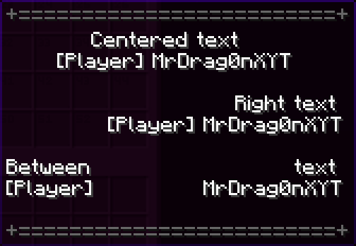

<div align="center">
  <h1>TextAligner</h1>
  <p>Simple expansion for PlaceholderAPI to configure text alignment</p>
  <u>English</u> | <b><a href="README_RU.md">Russian</a></b>
</div>

# 🤔 How is it work?

This extension adds spaces before a line to align it to the specified number of characters

<details><summary>Usage showcase with DeluxeMenus</summary>

```yaml
items:
  welcome:
    material: GLOWSTONE
    slot: 22
    display_name: "&#676767+=========================+"
    lore:
      - "&#fcfcfc          Centered text" # manually
      - "&#fcfcfc%textaligner_center;32;{luckperms_prefix} {player_name}%" # with placeholder
      - " "
      - "&#fcfcfc                           Right text" # manually
      - "&#fcfcfc%textaligner_right;32;{luckperms_prefix} {player_name}%" # with placeholder
      - " "
      - "&#fcfcfcBetween                        text" # manually
      - "&#fcfcfc%textaligner_between;32;{luckperms_prefix};{player_name}%" # with placeholder
      - " "
      - "&#676767+=========================+"
```



</details>

# 📌 Placeholders

- `%textaligner_center;<length>;<Text with {placeholder}>%`
- `%textaligner_right;<length>;<Text with {placeholder}>%`
- `%textaligner_between;<length>;<Left text with {placeholder}>;<Right text with {placeholder}>%`

Where:

- `<length>` - line length for alignment;
- `<Text with {placeholder}>` - text with PlaceholderAPI placeholders with `{}` instead of `%`

Replace with your values without `<>`, for example: `%textaligner_center;32;Hello, {luckperms_prefix} {player_name}%`

# 💾 Requirements

- Java **16+**
- Paper **1.16.5+**

# 🚀 Getting started

1. Install [PlaceholderAPI](https://spigotmc.org/resources/6245) plugin and restart server
2. Install [TextAlignerPlaceholder](https://github.com/MrDrag0nXYT/TextAlignerPlaceholder/releases/latest) to
   `/plugins/PlaceholderAPI/expansions/`
3. Run `/papi register TextAlignerPlaceholder-[VERSION].jar` or restart server.
   _(Replace `[VERSION]` to TextAlignerPlaceholder version)_

# ⚙️ Other information

### You can also (optionally) donate me:

- [DonationAlerts](https://www.donationalerts.com/r/mrdrag0nxyt)
- TON: `UQAwUJ_DWQ26_b94mFAy0bE1hrxVRHrq51umphFPreFraVL2`
- ETH: `0xf5D0Ab258B0f8EeA7EA07cF1050B35cc12E06Ab0`
- SOL: `4t9q2curHY4EL2skydjzUZ5JvbrLEmkZN5gHBu6qTPyN`
